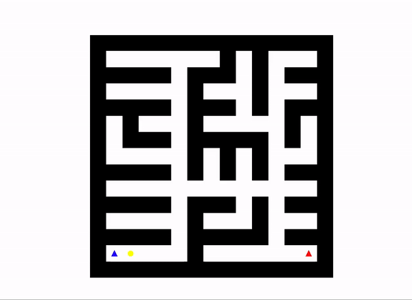

Completed by lpjones and ryuliou

# Maze Solver
# Goals
Solve a maze using either Dijkstra's or the A-star algorithm and display how the algorithm solves it. Below shows the A-star algorithm solving a maze.



# How to use
Download yolov3.weights file at https://pjreddie.com/media/files/yolov3.weights and move the file to the yolo_files/ folder

Executables: \
maze_solver.py

Takes in a maze and finds the shortest path from the start to the end points using either dijkstra or A-star

Usage:
```console
python3 maze_solver.py --algorithm astar -vis mazes/maze3.txt
```
Libraries: \
matplotlib \
numpy \
argparse \
os

# Instructions (Do not clone this repo!)

Due Date: November 20, 2023

In this assignment, you will implement Dijkstra's algorithm and the A* algorithm to solve a 2D maze. The maze consists of walls, open spaces, a start point, and an end point. Your task is to find the shortest path from the start to the end without passing through any walls.

## Environment Setup

You are not required to use the server or docker for this lab. The only requirements for this lab are:
- Python 3.x
- Matplotlib
- Numpy

## Assignment

Your task is to complete the [maze_solver.py](maze_solver.py) to perform path finding using A* and Dijsktra's algorithms. You will be provided mazes, and you must read the maze, run a selected algorithm, and output a solution found by that algorithm. ***Important:*** You are not allowed to use any existing Dijkstra's/A* code, you must develop the code yourselves. Failure to comply with these rules will yield you 0 points.

Here are the suggested steps:
1. Read the maze (<maze_name>.txt) to a matrix format, indicating paths available
2. Implement Dijkstra's and A* algorithms for give maze
3. Save shortest path found as <maze_name>_out.txt
4. Write plotting functions to visualize path finding process

Your program must be able to take in as an argument the maze (path to a maze.txt file), and an option to select which algorithm to run -- Disjktra's or A*. There should be an additional flag for visualization. If set, then your program will open the map and using matplotlib, show a visualiaztion of the search process. if not set, the code will simply output the solved maze by default.

```python
python maze_solver.py <path_to_maze_txt> --algorithm <dijkstra/astar>
```
(Additional --visualize flag to enable visualiaztion)

## Assignment Details

### Mazes

You are provided with 3 mazes to help build and debug your code. All mazes follow the same structure. Please see maze1 below:
```
#########
#     ###
# ### ###
# #   ###
# ### ###
#s##e   #
#########
```

The '#' character represents walls. ' ' or space is available paths you can follow. 's' is the starting point and 'e' is the ending point. All maze rows have the same number of characters. For example, maze1 above is (7,9).

Please complete `read_maze()` to read the maze. You are encouraged to read it as a matrix.

Here is the TA's output after reading maze1.txt, and also binarizing it (needed later for plotting)
```
Maze shape: (7, 9)
Original Maze:
[['#' '#' '#' '#' '#' '#' '#' '#' '#']
 ['#' ' ' ' ' ' ' ' ' ' ' '#' '#' '#']
 ['#' ' ' '#' '#' '#' ' ' '#' '#' '#']
 ['#' ' ' '#' ' ' ' ' ' ' '#' '#' '#']
 ['#' ' ' '#' '#' '#' ' ' '#' '#' '#']
 ['#' 's' '#' '#' 'e' ' ' ' ' ' ' '#']
 ['#' '#' '#' '#' '#' '#' '#' '#' '#']]
Binarized Maze:
[[1. 1. 1. 1. 1. 1. 1. 1. 1.]
 [1. 0. 0. 0. 0. 0. 1. 1. 1.]
 [1. 0. 1. 1. 1. 0. 1. 1. 1.]
 [1. 0. 1. 0. 0. 0. 1. 1. 1.]
 [1. 0. 1. 1. 1. 0. 1. 1. 1.]
 [1. 0. 1. 1. 0. 0. 0. 0. 1.]
 [1. 1. 1. 1. 1. 1. 1. 1. 1.]]
```

### Directions / Moving in the maze

To do path finding, once you read the maze you are only allowed to move in four directions: N,S,E,W. Diagonal movements are not allowed. All the weights per step are the same weight.

In a typical application of Dijkstra's algorithm, you are given a weighted graph. The algorithm finds the shortest path between nodes. For this assignment, all paths have the same "weight" or "cost" as there are no explicit weights in the maze. The cost of moving from one cell to another is always the same.

For the A* algorithm, you can utilize heuristics based on the Manhattan distance to optimize the search process.

### Search Algorithms

Each search algorithm operates in a similar fashion. From a given cell (start), we will run the algorithm to find the shortest path to cells until we reach the end cell.

- Update the visited cells as the algorithm progresses.
- Keep track of the predecessors for each visited cell to reconstruct the path once the end is reached.

#### Dijkstra's

You are provided with a function stub for `dijkstras_algorithm()`. Your implementation should find all possible directions you can move from the current location without hitting walls.
- Use an appropriate data structure to keep track of the next position to visit based on the shortest distance found so far.
- You must consider that the maze does not have weighted edges, and as such, the cost to move from one cell to the next is uniform.
- Hint: Think about using a priority queue or heap!

#### A* 
You are provided with a function stub for `a_star_algorithm()`. Your implementation should utilize the Manhattan distance heuristic to estimate the distance from the current cell to the end cell.
- Similar to Dijkstra's algorithm, use an appropriate method to decide the next cell to visit. For A*, we will use the sum of the current path cost and the heuristic cost to determine next best/shortest path to pursue.
- Make sure to update the priority of a cell in the queue if a shorter path to that cell is found.

### Program Output

#### Solved Maze
Your program must save the solved maze with 'x' character as the path drawn on the original maze.
Here is the sample output for `maze1.txt` (output saved in `maze1_out.txt`):
```
#########
#xxxxx###
#x###x###
#x#  x###
#x###x###
#s##ex  #
#########
```

#### Visualization

You are provided with a function stub for `plot_maze()`. Please use this to visualize the maze and the search process.

##### Conditional Visualization: 
The function should first check if visualization is enabled by the visualize flag. If not, the function should terminate without performing any actions.

##### Maze Conversion: 
Convert the textual representation of the maze into a binary format suitable for visualization. In this binary maze, open cells (' ' or 's' or 'e') should be represented by one value (e.g., 0) and walls ('#') by another (e.g., 1). 

##### Plotting the Maze: 
Use Matplotlib, to create a visual representation of the binary maze. The colors and styles used should clearly differentiate between walls and paths. You can plot using: `plt.imshow(binary_maze)`, but you will need to read the function documentaion to plot it well.

##### Plotting Points of Interest:
- Plot the start point in a color (e.g., green) to indicate the beginning of the maze.
- Plot the end point in a contrasting color (e.g., red) to indicate the goal.
- Plot the current position of the algorithm in a distinct color (e.g., blue) to show where the search is currently focused.
- Plot all visited cells in another color (e.g., yellow) to track the search algorithm's progress.
- Use `plt.plot(point_x, point_y, shape_color)` given a coordinate (point_x,point_y) on your 2D matrix maze. if you use 'ro' as shape_color, a red circle will be plotted.

##### Updating the Visualization: 
As the search algorithm runs, the current position and the set of visited cells will change. Update the plot in real-time to reflect these changes. Use `plt.pause(seconds)` with a chosen number of seconds to make the visualization smooth to follow.

You can call your function `plot_maze()` with additional parameters with the updated state of your path finding at every step of your path finding. 
Hint: your function stub is given a visited parameter, which the TA used to plot all visited (yellow) circles at every step, and the current node we are on. It is also recommended to pass in start and end points to plot them.

The TA's output visualizations will soon be added as a reference!! Set appropriate aspect ratios, plot sizes, and other aesthetic parameters to ensure that the maze is easily interpretable.

Here is a sample of how the TAs output looks (the final iteration output from maze1.txt). Yellow circles are visited nodes, green are the final path chosen. Start is in blue and end is in red.


## Evaluation

### Grade Breakdown

- Program Correctness: 60%
- Program Efficiency: 20% 
- Program usability, readability & design: 10%
- Interactive Grading: 10%

You are allowed to work in pairs for this assignment. Please avoid excessive collaboratation with other groups.

#### Program Corectness (80%)
Ensure your program final paths match those provided by the TA. The TA will also provide the Dijktra's and A* videos, however due to some randomness in selecting shortest path of same length, it may be possibke your visualization do not match exactly, but are expected to be very similar.

#### Program Efficiency (20%)
In this assignment, your program must also be efficient. You must sselect efficient and suitable data structures and algorhtms throughout your program.

#### Program Usability, Readability & Design (10%)
Please make sure your programs are well commented and readable. Make sure to adress invalid CLI inputs or missing inputs. If the programs are used incorrectly, your programs should exit safetly and output the correct use. Have functions wherever necessary for readability. 

Your `read_map` must be able to identify if the map is invalid or wrong format. Ensure that the map's width is the same throughout. If there are no solutions or paths found from start to end, your program must break clean.

#### Interactive Grading (10%)
Since this is a group assignment, there will be interactive grading for this project. This is just to verify that all members understand the code fully. Hence, this will be individual -- to make sure you succeed, make sure you understand all of your submitted code, even if there are parts you did not code yourself. Interactive grading will be done during lab hours the week after assignment is due.

## Submission

Graded files:
- ```maze_solver.py```

## Credits

Kartik Patwari, Jeff Lai, and Chen-Nee Chuah
