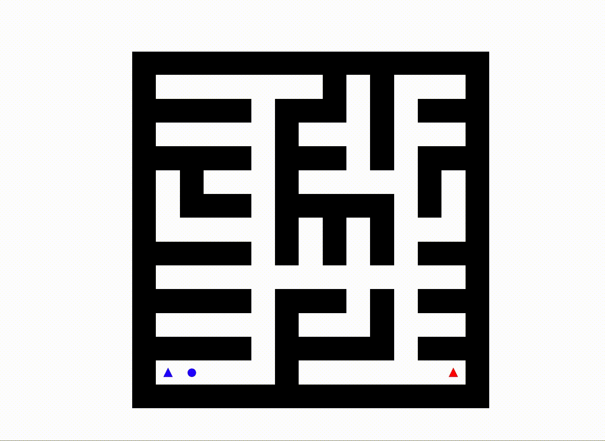

Completed by lpjones and ryuliou

# Maze Solver
# Goals
Solve a maze using both Dijkstra's and the A-star shortest path algorithms.

Dijkstra's Algorithm



A-star Algorithm


# How to use
Download yolov3.weights file at https://pjreddie.com/media/files/yolov3.weights and move the file to the yolo_files/ folder

Executables: \
maze_solver.py

Takes in a maze and finds the shortest path from the start to the end points using either dijkstra or A-star

Usage:
```console
python3 maze_solver.py --algorithm astar -vis mazes/maze3.txt
```
Libraries: \
matplotlib \
numpy \
argparse \
os